**Setting up Charles Proxy in macOS**

1. Download and install charles proxy from - https://www.charlesproxy.com/.  
2. Open the app.  
3. Go to: `Help > SSL Proxying > Install Charles Root Certificate`  
4. Add the root certificate to login key chain.  
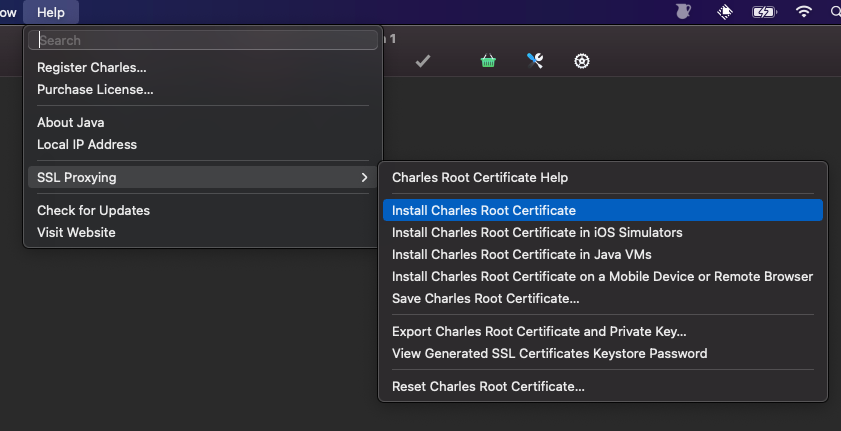  
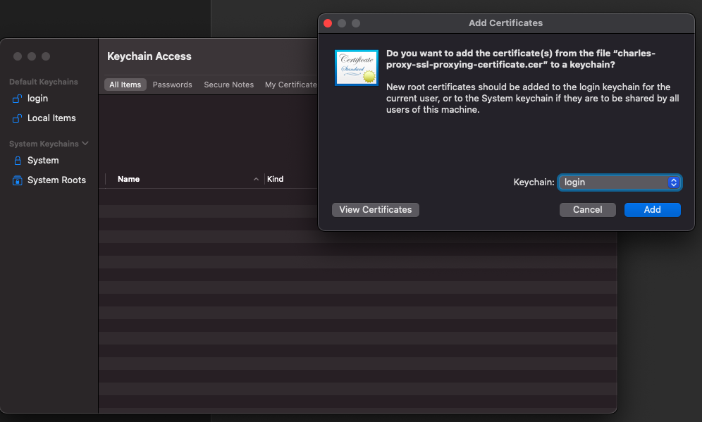  

**Inspecting iOS Simulator Traffice**
1. Install the Root Certificate in iOS Simulator in use for testing.
(To install iOS Siumulators - Download Xcode from App Store)  
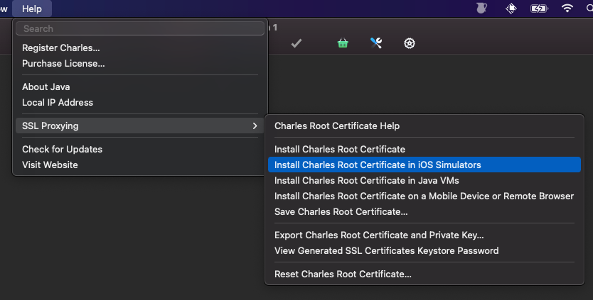  
2. Trust the installed certificate in Simulator.   
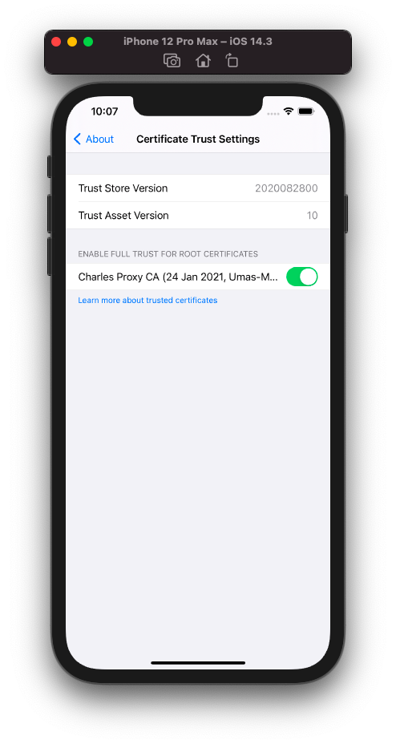
3. Run the app from `Xcode`. (Checkout the source code from your team's repository or get it from development team.)  

**Note:**
When inspecting network requests via `Charles` always launch Charles first and launch the mobile app next. If the app is launched first Charles app will not record any requests.

4. Push the start recording button in Charles app.  
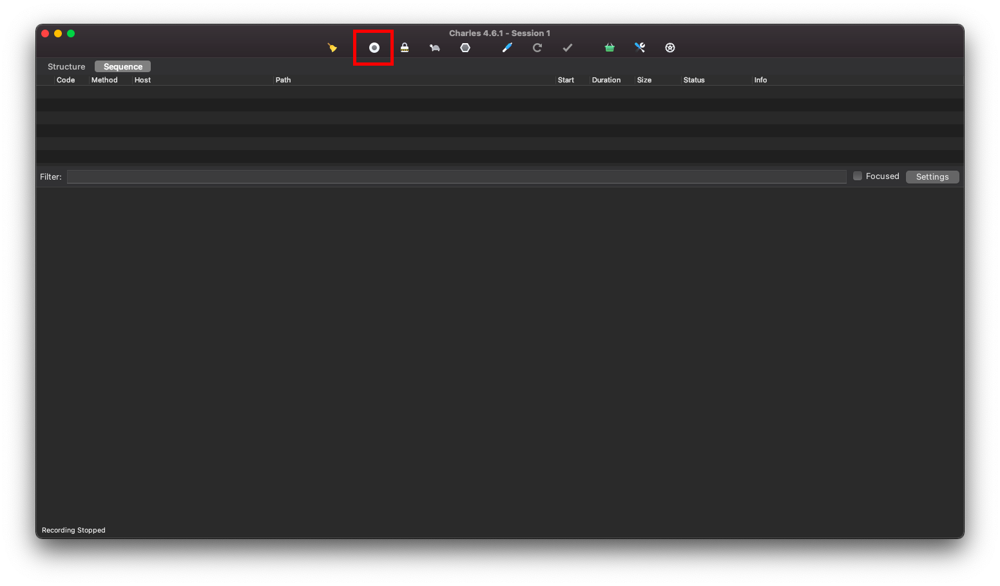
  

5. Now you can see all the network requests from the mobile device or simulator connected. I have just filtered on a specific request - `https://api.stackexchange.com/2.2/users?order=desc&sort=reputation&site=stackoverflow` for example.  
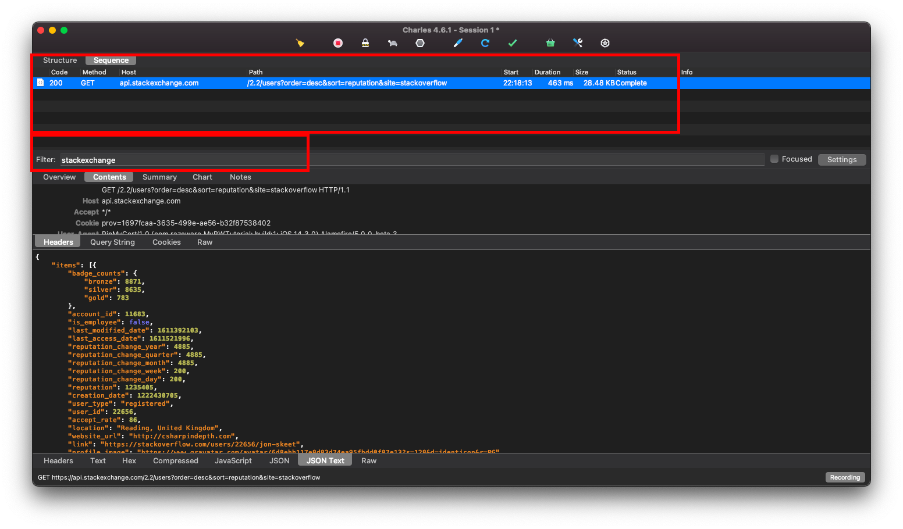  

**Inspecting network traffic in an Andrid Device**
1. Go to `Help > SSL Proxying > Install Charles Root Certificate on a Mobile Device or Remote Browser `.  
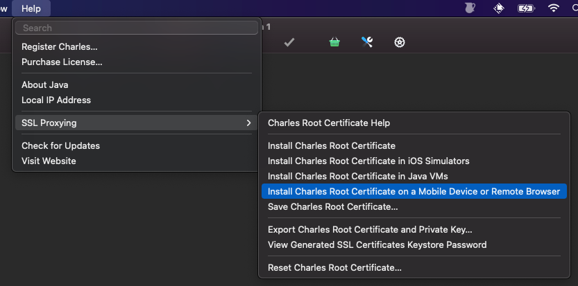  
2. Follow the instructions from Charles.
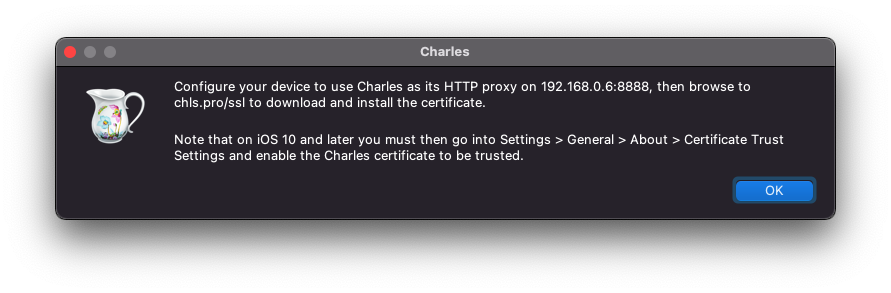
3. Configure your test Android device with proxy address from Charles app and save proxy settings.  
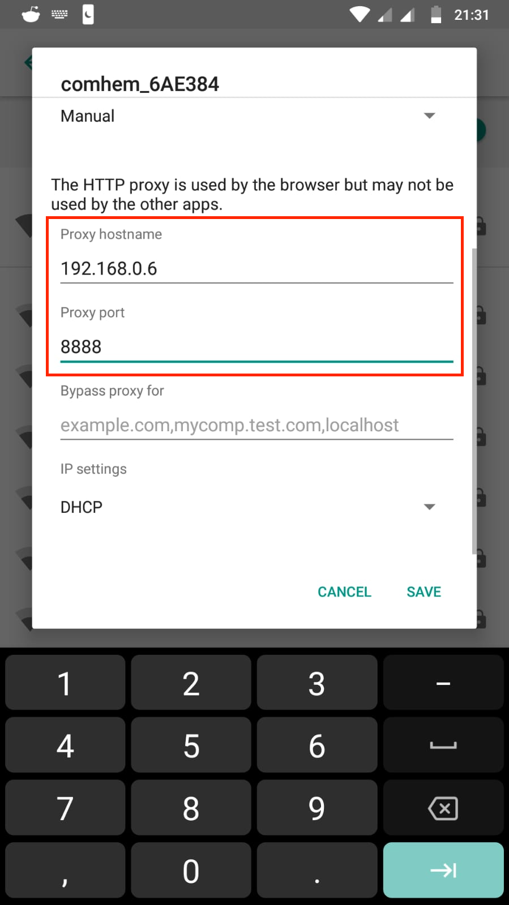  
4. Visit `chls.pro/ssl` from the device.  
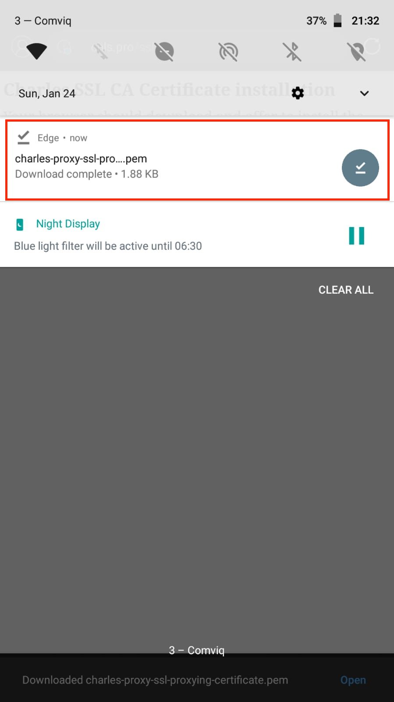  
5. Open the downloaded certificate to trust it and save.  
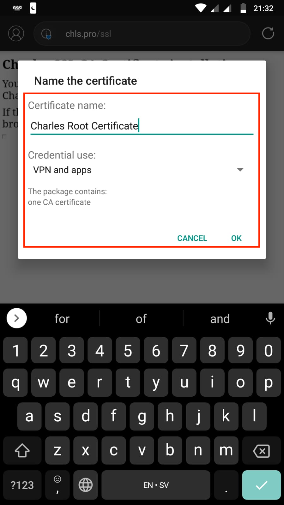

Now you can see all the traffic from test mobile device.